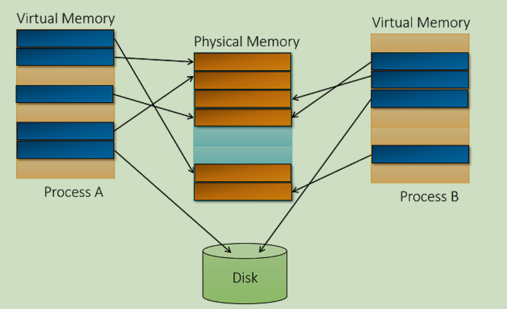
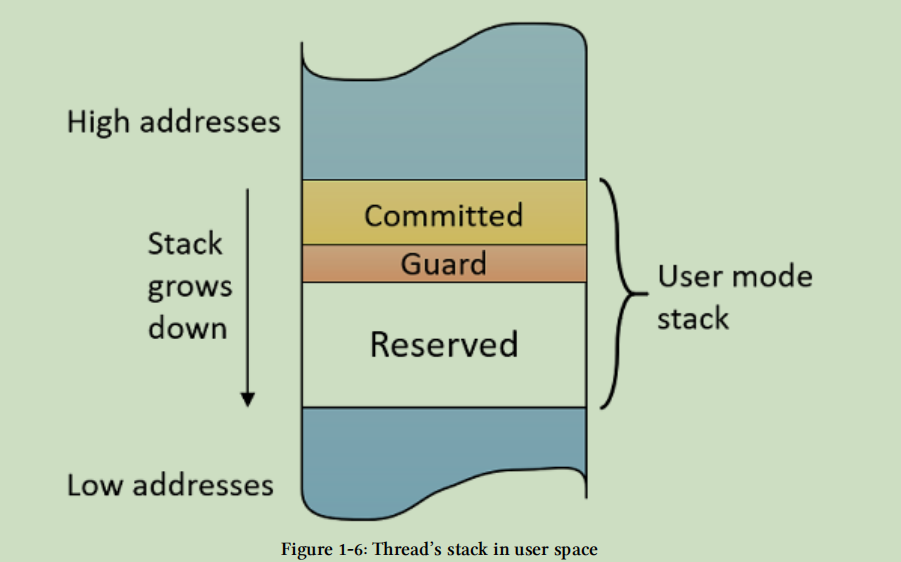
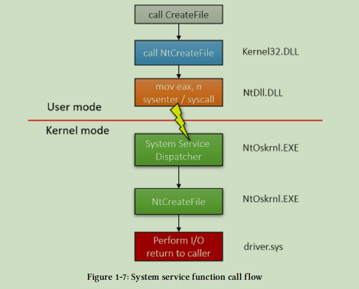
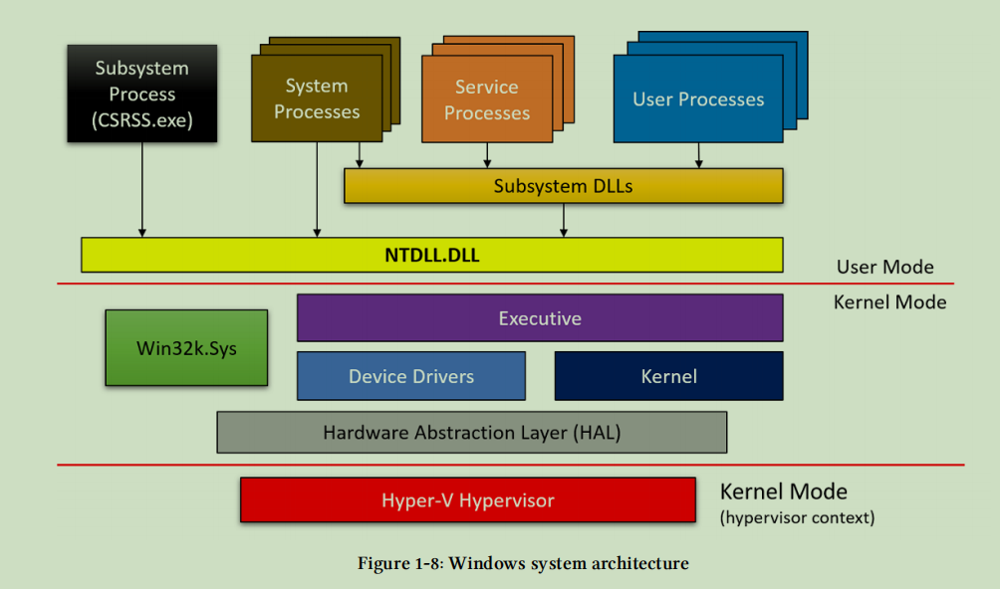

## Windows Internals Overview

#### Processes

- 进程是一个运行中的程序和管理一些对象的容器
- 通常说的一个运行的进程是不准确的，进程不会运行，进程只做管理，线程才是用来执行代码的
- 一个进程通常拥有以下资源
  - 一个可执行文件，包含了初始的代码和数据
  - 一个私有的虚拟地址空间
  - 一个主token，被称为访问令牌的安全环境，标识了与该进程相关的用户，安全组，特权，uac，会话等状态。
  - 一个私有句柄表，指向打开的各种对象，event、mutex、thread、process、file等等api返回的handle都是这个句柄表的偏移
  - 一个以上的线程，一个普通的用户程序都会有一个主线程来执行main/winmain这些代码
- 
- 一个进程有一个唯一的进程id，永远不会有两个进程有相同的id，除非有人做了一些恶意操作。但是，如果一个进程结束了， 它的id有可能会被新运行的程序所使用。

#### Virtual Memory

- 每一个进程都有它自己的线性虚拟地址空间，这个空间内，由ntdll这些子系统dll最先占用一块空间
- 当线程运行起来时，可能会申请一些内存，加载额外的一些dll等等。
- 进程所占用的虚拟空间的大小由进程和系统决定
  - 32 进程在 32 系统下，进程默认用户空间大小是 2GB，但是进程本身可以设置LARGEADDRESSAWARE 标志，要求使用 3GB 大小的用户空间
  - 64 进程在 64 系统下，win8 之前，大小是8 TB，win8.1之后，大小是 128 TB
  - 32 进程在 64 系统下，如果有 LARGEADDRESSAWARE 标志，则是 4GB，否则还是 2GB
- 内存虚拟的概念，表示进程中的内存并不是直接映射到物理内存中的，有可能在物理内存中，也有可能在页交换文件中。应用程序并不会关心内存到底在哪里，因为如果内存没有在物理内存中，那么访问这个虚拟地址，就会触发一个 PageFault 异常，然后在 cpu 和操作系统的配合下，将这块内存指向的数据，从页交换文件中移动到物理内存中。
- 
- 虚拟内存管理的单位是一页。操作虚拟内存的函数操作粒度都是以页为单位，比如页属性，页状态等等。页的大小由 cpu 和操作系统的决定。在window上，一页通常是 4k 。
- 内存是由页表去管理的，哪块虚拟内存对应哪块物理地址，都在页表中记录着，所以cpu在访问地址时，会进行一个转换，由虚拟地址到物理地址的转换，需要去查询页表，页表的管理方式也有不同，有32位下，又开启pae和没开启pae的，在64位下，还有一个4级页表寻址。具体可以查看软件调试这本书，第二版的第一卷<硬件基础>。
- 除了正常的 4KB页， windows 还支持一些大页，x86系列最大支持 2MB，arm 最大支持 4MB。

#### Page State

- 页的状态有三种：
  - free：这块内存并没有被使用，直接访问这块内存会触发异常。
  - committed：这块内存已经被使用了，可以以合适的方式访问这块内存。不合适指的是去写一个只读的页，也会引发异常。
  - reserved：这块内存没有被使用，但是被预定了，从 cpu 的视角来看，这个属性和 free 并没有什么区别，直接访问就会引发异常，但是对于操作系统来说，使用 VirtualAlloc 函数不指定具体地址去申请虚拟内存时，并不会申请到这块空间。这个属性通常用来保存虚拟空间的连续性，比如后面要讲的 线程堆栈。

#### System Memory

- 一个进程的虚拟空间的较低的地方被进程使用，较高的空间由内核使用。一个用户线程运行时只能访问用户空间，访问内核空间会引发异常，用户空间和内核空间占用的大小由以下几种情况
  - 32 系统上，没有指定 LARGEADDRESSAWARE 标志的情况下，0 - 0x7fffffff 属于用户空间，0x80000000 - 0xffffffff 属于内核空间
  - 32 系统上，指定了 LARGEADDRESSAWARE 标志 ，0xc0000000 - 0x7fffffff 才属于内核空间。
  - 64 系统上， win8 及之前，内核使用虚拟空间的 8TB
  - 64 系统上， win8.1 及之后，内核使用虚拟空间的128TB
- 内核空间不是过程相关的。指的是每一个进程的内核空间的数据都映射到指向相同的物理地址上。

#### Threads

- 一个真正执行代码的实体是线程。一个线程是一个进程的一部分，线程运行时会使用进程的资源，比如 虚拟地址空间、句柄等等。
- 一个线程拥有以下资源
  - 当前的访问权限，是内核还是用户
  - 执行上下文，由 cpu 决定。
  - 最少一个堆栈，一个内核线程只有一个内核堆栈，但是一个用户线程，有用户和内核两个堆栈空间。
  - 线程局部存储。
  - 基础优先级和当前优先级。
  - cpu核心亲和度，指示当前线程允许在哪个cpu的核心上运行。
- 一个线程通常有以下几种状态
  - 运行：当前线程正在某个cpu核心上执行代码
  - 准备：当前线程已经准备好开始执行了
  - 等待：没有执行，处于等待状态，等到执行的条件符合了，状态会更改为准备
  - 

#### Thread Stacks

- 每一个线程在执行代码的时候都有一个栈，来存放局部变量，函数参数，和当前函数的返回地址。
- 一个线程最少有一个内核堆栈，非常小，32 系统默认是12KB，64 系统默认是 24 KB。
- 一个用户模式的线程会有两个堆栈，一个用来存放用户代码的局部变量，用户栈一般是比较大的，默认1mb大小，一个用来存放内核代码的局部变量等。大家可以基于安全性去想一下，如果内核代码还是使用用户空间得代码，是否会引入一些安全问题？
- 前面已经说了，用户空间的代码和堆栈都是有可能不在物理内存中的，但是内核空间的代码和堆栈，都是一直存在于物理内存中，所以每个线程的内核堆栈是比较小的。但是县城也分为两种，一种是普通线程，一种是gui线程，系统对gui线程特别处理，分配一个较大的内核堆栈，有兴趣的朋友可以看一下 潘老师的内核原理与实现。
- 用户堆栈是一种可增长的堆栈，是什么意思呢，指的是一个线程的用户堆栈最开始只申请很小的一块内存（甚至小到一页，相比默认1mb的栈是很小的了），然后其余的那块栈空间以reserved的方式保留起来，所以用户代码申请空间的时候并不会申请到这些空间。当用户代码使用堆栈 时超过了这一页大小的时候，会访问到reserved这块空间，系统为了实现栈能增长的这种特性，为页增加了一种属性 PAGE_GUARD ，当用户代码访问到这块空间时，就会产生一个异常，操作系统发现这是一个guard page，就会将栈变大，然后将下一页的属性设置为 PAGE_GUARD，这样的话，一个用户线程创建出来的时候，就没有必要一次性将所有栈空间申请出来，因为资源是宝贵的，如果你申请了但是没有用到这么多，是很浪费的。
- 一个用户线程的堆栈由以下几种情况
  - 由pe文件中的堆栈大小决定。
  - 由创建线程时 CreateThread 时指定的堆栈大小决定。还可以指定预先提交的大小和保留的大小，由 标志位决定。

#### System Services && System Call

- 应用程序需要执行一些操作，不是纯粹的计算之类的，比如申请内存，打开文件，创建线程等等。这些操作只能由内核代码去完成。所以，操作系统肯定要提供一种方式，从用户代码进入内核代码的方式。下面以 一个notepad 程序打开文件为例，程序到底是怎么能用户代码进入到内核代码的
- 
- 注意，用户最后调用的函数 NtCreateFile  进入内核之后的函数还是 NtCreateFile，它们不是一个函数，只是有一个相同的名字而已。用户层的函数的代码只是调用内核函数代码的入口而已。

#### General System Architecture

- 

#### Handles and Objects

。。。

##### Object Names

。。。