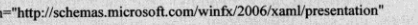
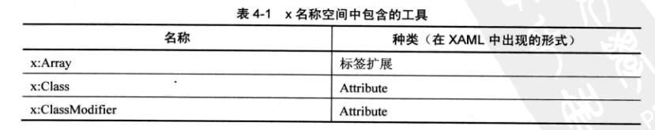
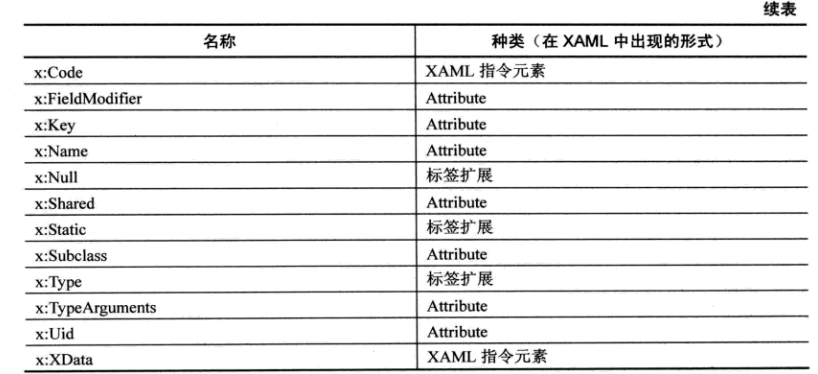
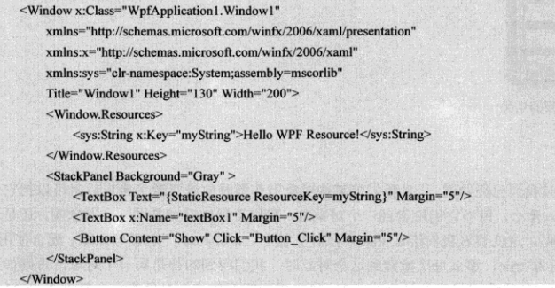
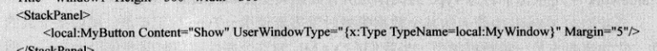
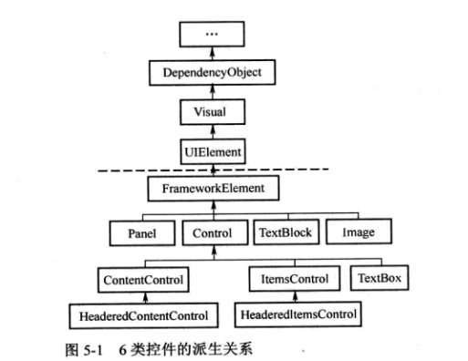

#### 一：xaml

1. 名称空间
   1. 定义名称空间的好处是，当来源不同的类重名的时候，可以使用名称空间加以区分。
   2. xmlns之后可以跟着可选的冒号和名称段前缀，不加就是默认的名称空间，默认的名称空间只能有一个，一般选择其中元素最频繁使用的名称空间来承当默认名称空间，比如wpf模板生成的代码中，window grid都在默认的名称空间中。
   3. 一般映射一个段前缀x的名称空间，这个名称空间里包含着一些对应XAML语法和编译相关的
   4. X:Class：这个Attribute的作用是，当XAML解析器将包含它的标签解释成C#类时，这个类的类型是什么。相当于编译器在编译时将我们所编写的xaml代码编译成了一份C#代码。这个class指定编译成的类在哪个名称空间，叫什么名字。
2. 使用标签的Attribute为对象属性赋值
   1. 通过AttributeName = value 这种方式，由于XAML语法限制，value只能是一个字符串值。
      1. 如果一个类能使用XAML语法声明，并允许它的 Property与XAML的Attribute互相映射，那么就需要提供一种这样转换机制。
         1. 解决方法：使用TypeConverter的派生类，并在类中重写TypeConverter的一些方法
      2. 要解决value只能是字符串值的缺陷，可以使用Property Element属性元素来处理复杂的赋值
3. 标记扩展
   1. 有时候需要将一个对象赋值给两个对象的属性，有的时候需要给对象赋值null。
   2. binding实质上还是创建了一个bingding类对象。
   3. 只有MarkupExtension类的派生类才能使用标记扩展语法标记对象
4. 事件处理器与代码后置
5. X名称空间
   1. 在解析和编译XAML代码时，需要告诉编译器一些重要的信息，比如xaml编译后的代码应该与哪份C#代码合并，使用XAML声明的元素访问级别是public还是private等，这些东西就存储在X名称空间中
   2. 
   3. 
   4. X--Attribute
      1. X:Class：告诉编译器xaml编译后的代码与哪个C#类合并，只能用于根节点
      2. X:Class Modifier：告诉编译器由标签生成的类具有怎样的 访问控制级别
      3. X:Name：一个XAML标签实际上是定义了一个对象，要想访问这个对象可以从父节点的content依次寻找来得到，但是可以通过使用X:Name来为对象直接添加一个引用。
         1. 告诉XAML编译器，当一个标签带有XName时，除了为这个标签生成对应实例，还要同时生成一个名为Name的引用变量
         2. 将XAML标签对应的Name属性（如果有），也设置为XName的值，并把这个值注册到UI树上，方便查找。
         3. Name属性定义在FrameworkElment类中，这个类是wpf控件的基类，所有wpf控件都具有Name属性。
         4. 对于一个标签同时具有Name属性时，使用Xname和name来为Property赋值是相同的，但是如果标签对应的类没有Name属性，为了方便在后台代码中访问变量，就只能使用X:Name属性。
      4. X:FieldModifier：标签对象默认的访问级别是internal，可以使用这个Attribute更改成另外的访问级别。
         1. 使用X:FieldModifier的前提是标签使用了X:Name，不然何来的引用对象呢？
      5. X:key：在xaml中，我们可以将多次使用的内容提取出来放在资源字典中，需要的时候就使用key获得它。
         1. 
         2. 同样可以在C#中使用资源，在一个有资源的对象上调用FindResouce即可得到key对应的value
      6. X:Shared
         1. shared一般与key配合使用，如果shared值为true，表示每次使用资源获取到的对象都是同一个对象，否则得到的是一个新的拷贝。默认为true
   5. X--标记扩展
      1. X:Type
         1. 设置属性值是某个类型。
         2. 
      2. X:NUll
         1. 大多时候我们不用显示地为某个属性赋null值，但如果一个属性具有默认值而我们有不需要这个默认值就需要显示地设置为null了
      3. X:Array
         1. 通过他的Items属性向使用者暴露一个类型已知的ArrayList实例，ArrayList内的成员类型由X:Type指定。
      4. X:Static
         1. 在Xaml文档中使用数据类型的static成员。

#### 二：控件与布局

1. 六类控件
   1. 布局控件：可以容纳多个控件或者嵌套其他布局控件，用于在UI上组织和排列控件。Grid Stackpanel DockPanel都属于此类，共同父类是Panel
   2. 内容控件：只能容纳一个其他控件或布局控件作为它的内容。window button属于此类。共同父类ContenControl
   3. 带标题内容控件：相当于一个内容控件，但可以加一个标题。标题部分亦可容纳一个控件或布局。Groupbox Tabitem 等属于此类，共同父类是HeaderedContentControl
   4. 条目控件：可以显示一列数据，一般情况下这列数据类型相同。包括ListBox ComboBox等，共同基类ItemsControl
   5. 带标题条目控件：相当于一个条目控件加上一个标题显示区。TreeViewItem MenuItem属于此类。共同基类HeaderedItemsControl
   6. 特殊内容控件：比如TextBox容纳字符串，TextBlock容纳自由控制格式的文本。Image容纳图片
   7. 

#### 三：WPF内部机制

1. Binding

